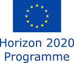

## Unveiling the Ecosystem of Science: A contextual perspective on the many roles of scientists

**Research is a team effort**. Scholars distribute roles based on the different research activities they perform. These roles shape the academic profile that will define them during their career trajectory. These roles will also change as they acquire experience and seniority. Some scientists coordinate, design and lead research agendas; others develop and produce new tools and software for data collection and processing; others develop conceptual and theoretical frameworks; others engage with non-academic stakeholders and bridge with societal demands.

However, most research evaluation schemes consider career paths as homogeneous, promoting 'scientific excellence' and 'academic leadership' as the main and desired profile researchers should aim at, without considering the underlying diversity of roles and activities. **To unveil this diversity of academic profiles and career options scientists have, we aim to provide novel insights into different professional paths and skills necessary in scientific research**. This is an essential step towards developing more nuanced and advanced research evaluation approaches, maximizing researchers' strengths and acknowledging the heterogeneity needed in the scientific workforce to promote a healthy and sustainable research system, compared to the monotonous situation that currently exists.

### Team members

- **Nicolas Robinson-Garcia - PI (Fellow)**. Marie Sklodowska Curie Experienced Researcher from the [LEaDing Fellows Programme](http://leadingfellows.eu) working at Delft Institute of Applied Mathematics (TU Delft). Social scientist and bibliometrics expert. [Learn more about Nicolas](http://nrobinsongarcia.com).

- **Tina G. Nane - Supervisor**. Assistant professor at Delft Institute of Applied Mathematics (TU Delft) and visiting researcher at CWTS (Leiden University. Member of the Applied Probability research group. [Learn more about Tina](http://dutiosb.twi.tudelft.nl/~tnane/).

- **Rodrigo Costas - Collaborator**. Senior researcher at CWTS (Leiden University). Rodrigo's research focuses on the development of new social media metrics (altmetrics), new scientometric applications at the individual-level and the study of funding acknowledgements.[Learn more about Rodrigo](https://www.cwts.nl/people/rodrigo-costas)

- **Thed N. van Leeuwen - Collaborator**. Senior researcher and co-leading the research theme on open scholarship at CWTS (Leiden University). Thed's research focuses on the various aspects of open scholarship, as well as on the research assessment of scholarly activity in the social sciences, the humanities, and law. He is co-editor of the OUP journal Research Evaluation. [Learn more about Thed](https://www.cwts.nl/people/thed-van-leeuwen)

### Research outputs

**Conference proceedings**

- Robinson-Garcia, N., Costas, R., van Leeuwen, T.N., Nane, T. [Towards a multidimensional valuation model](docs/LF-model-ISSI2019-poster_final.pdf) (Poster). *Accepted at the ISSI 2019 Conference held in Rome (Italy), Sep 2-5, 2019.*
- Robinson-Garcia, N., Costas, R., van Leeuwen, T.N., Nane, T. Towards a multidimensional valuation model. *Accepted at the Atlanta Conference 2019 held in Atlanta (United States), Oct 14-16, 2019*

**Working papers**

- Robinson-Garcia, N., Costas, R., Sugimoto, C.R., Larivière, V., Nane, T. Identifying scientific profiles and their effects on research trajectories. *In preparation*
- Robinson-Garcia, N., Costas, R., van Leeuwen, T.N., Nane, T. Unveiling the ecosystem of science: Towards an integrative valuation model of the many roles of scientists. *In preparation*

### About the project

To learn more about the project, please read the [summary of proposal and training plan](docs/LF-Summary-proposal-training-plan.pdf).

This project has received funding from the European Union's Horizon 2020 research and innovation programme under the Marie Sklodowska-Curie grant agreement No 707404. The opinions expressed in this project site reflect only the author's view. The European Commission is not responsible for any use that may be made of the information it contains.

